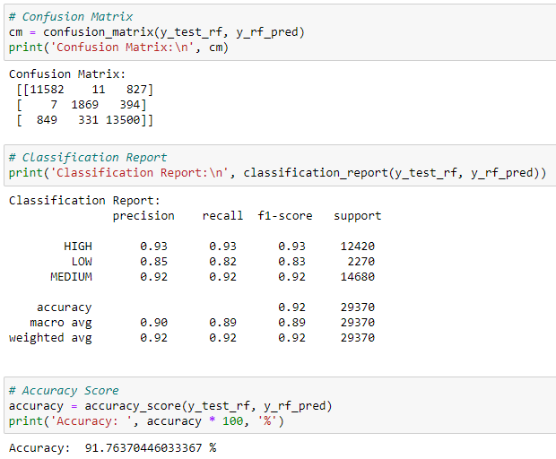

# Group 2: Zachary Barham, Stacy Burton, Ramley Porro, Julius Richards
## How do external factors - noise pollution levels and crime rates - affect housing prices in Wake County, NC?

### Presentation Links:
* [Google Slides](https://docs.google.com/presentation/d/1u6TKV_Wem4XKEXndj77MtcgVqmlJYIViQEOEHzTcJ3g/edit?usp=sharing)
* [Presentation Script](https://docs.google.com/document/d/1B15chVxJ7DSwh86WUJSJSIajOahEvpRORAYmJi533Eg/edit?usp=sharing)

### What are we looking for? Why?
Wake County, NC, is a popular area that is growing twice as quickly as the rest of North Carolina, [at a rate of 62 people per day](https://www.wake.gov/departments-government/planning-development-inspections/planning/census-demographics/growth-and-population-trends). With this comes an increase in housing demands, leading to rising interest in the housing market. With an abundance of well-documented data surrounding the topic, we wanted to assess the correlation between the values of single-family homes, noise pollution levels, and crime rates within the county.

### Our Data
* [Wake County residential data](https://www.wake.gov/departments-government/tax-administration/data-files-statistics-and-reports/real-estate-property-data-files)
  * Total value, site address, city, zip code, planning jurisdiction, zoning, acreage, heated area, age, bath count, remodel/addition status, style
  * NOTE: A key to the data fields in our housing data is located [here](data_files/clean/housing_data_fields_key.docx)
* [Local City Police Department crime data in Wake County](https://www.wake.gov/departments-government/city-county-bureau-identification-ccbi/criminal-arrest-records)
  * Crime counts by municipality; separated into personal, property-based, and drug-based crimes
* [USDOT National Transportation Noise Map data](https://maps.dot.gov/BTS/NationalTransportationNoiseMap/)
  * Noise Rasters converted to CSV with ArcGIS to assess dB from transportation impacting a properties/parcel sound level

### Data Exploration
During our data exploration phase we wanted to find a reliable and thorough dataset to begin our analysis, we found this in the Wake County tax data. While the tax data had quite a lot of information we decided to remove all of the data that did not affect the attributes of the home or its location. Looking outside of the data presented by the county, we found transportation noise rasters to be able to assess how sound can impact the comfort of a home. We used GIS to relate the dB level raster with the tax parcel data to use alongside our other sources. To find crime rates we had to pull data from many cities around the county but were able to find the needed tables to work with.

### Analysis Phase
* In our analysis we have categorized the factors which affect the desirability of the home
* We have used SQL to join our data for further assessment
* We have used tableau to help visualize our findings
* We have created a SQLite database to connect to to our dataset away from a local database environment to best work with the data as a group and to share with those who would like to test our code.

### Why we chose SQLite for Our Database Model over AWS and PostgresSQL
* For this project we had the choice of using either AWS or SQLite. We went with SQLite because it is a lightweight, file-based relational database management system (RDBMS) that is well suited for small- scale   * projects like ours. AWS offers a wide range of database options. 
* AWS can be more expensive than SQLite, especially for small-scale projects and also more complex to setup and manage. 
* Another Database Model we could use is PostgreSQL. While both are free and Open-source RDBMS, there are a few key differences. SQLite is a Serverless DBMS able to run in your applications and PostgreSQL is set * * up to run over a network. Like AWS PostgreSQL has a much larger size and is more complex which makes SQLite more appropriate and user-friendly for our project.
* Because SQLite stores its database in one ordinary disk file in any location within the directory, it makes SQLite one of the most portable RDBMS. SQLite also uses much less memory than PostgresSQL.
* We therefore decided to work with SQLite for the purpose of our final project.

### Machine Learning Model
To begin our model we did pre-processing of the dataset, which involved cleaning the data and handling missing values. Next, we performed feature selection and engineering to pick the most relevant variables. We initially selected a Linear Regression model for its simplicity and interpretability, although it didn't yield the strongest results. Wanting to improve our model performance, we then opted for a Random Forest Classifier. The dataset was transformed to accommodate this model, with our target variable 'TOTAL_VALUE' being converted to categorical values representing 'Low', 'Medium', and 'High' price ranges. We divided our data into training and testing sets, and then proceeded to train our Random Forest model. The final model demonstrated an impressive accuracy of approximately 91.76%, a substantial improvement over the initial Linear Regression model. The outcomes were evaluated using a confusion matrix, which demonstrated our model's ability to predict the housing prices with a reasonable degree of precision across various price ranges.

